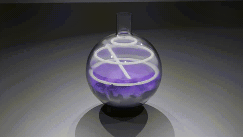
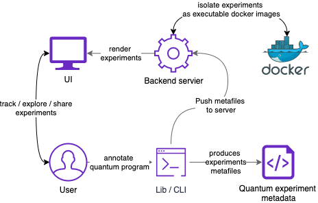
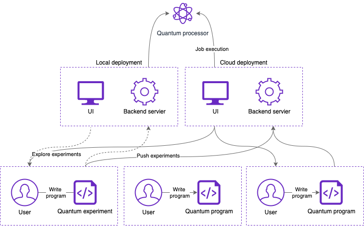
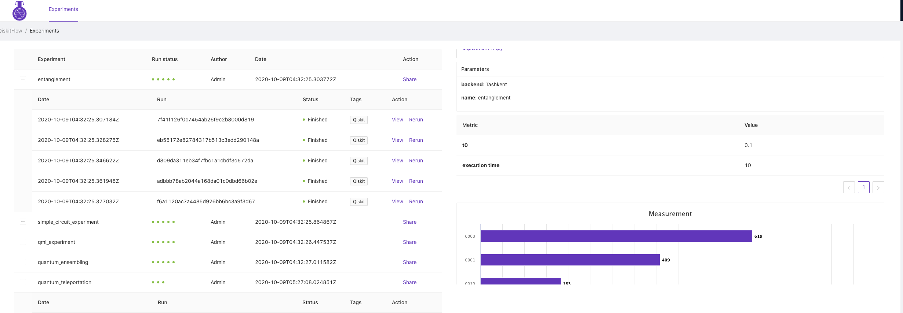
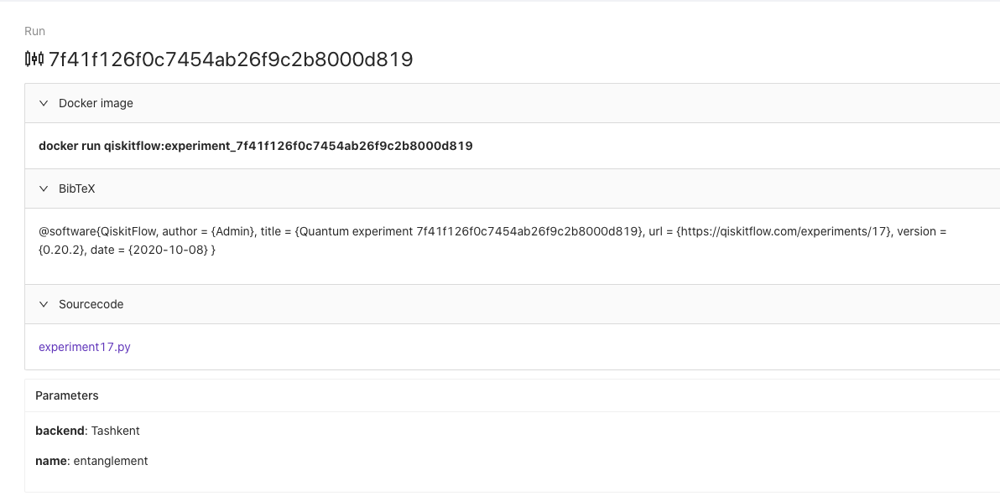
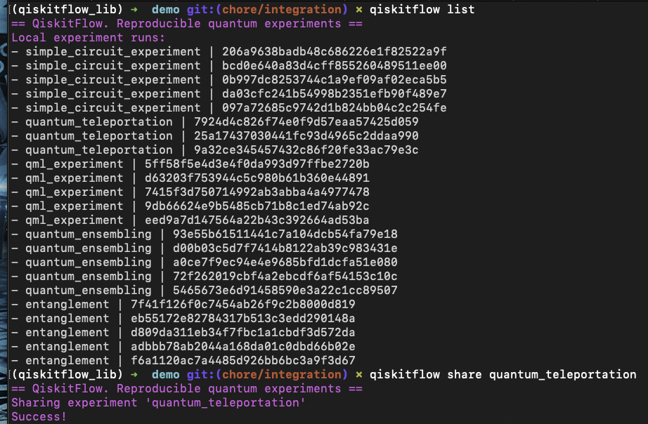
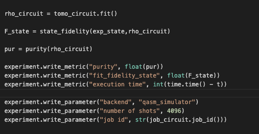

QiskitFlow. Reproducible quantum experiments.
=============================================

Platform for tracking, sharing and running quantum experiments in a clean and understandable for developers, researchers and students manner.

> Alpha release is in the works. 
> Files from hackathon project are located in [hackathon folder](./hackathon)

* [General overview](#general-overview)
* [Deployment](#deployment-options)
* [Screenshots](#screenshots)
* [How to run](#how-to-run)

### General overview

### Deployment options

### Screenshots

#### UI (experiments)

#### UI (run)

#### CLI

#### Lib / annotation

