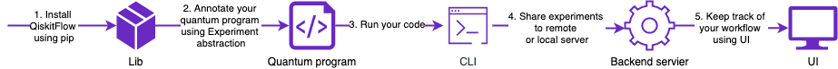
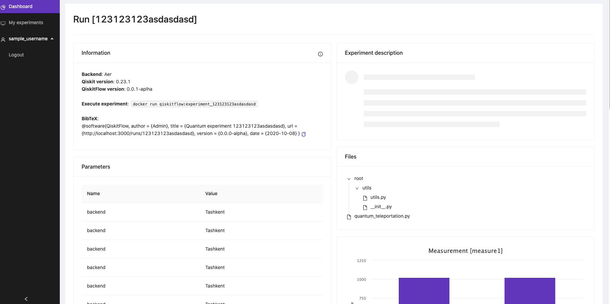

QiskitFlow. Reproducible quantum experiments.
=============================================

Platform for tracking, sharing and running quantum experiments in a clean and understandable for developers, researchers and students manner.

> Alpha release is in the works. 
> Files from hackathon project are located in [hackathon folder](./hackathon)

* [General overview](#general-overview)
* [Screenshots](#screenshots)

### General overview

### Screenshots

#### UI 

#### CLI / Lib

Screenshots/documentation for CLI and library is in [lib folder](./lib)

