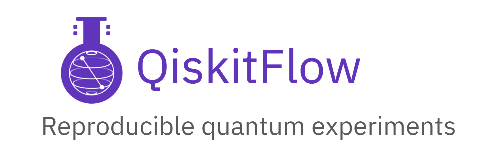

QiskitFlow
==========



Qiskit global hackathon project.


Platform for tracking, sharing and running quantum experiments in a clean and understandable for developers, researchers and students manner.

> Alpha release is in the works. Alpha release refactored components of QiskitFlow will be located in `qiskitflow_lib`, `qiskitflow_server`, `qiskitflow_ui` folders. Later on folders developed during hackathon will be removed.


* [General overview](#general-overview)
* [Deployment](#deployment-options)
* [Screenshots](#screenshots)
* [How to run](#how-to-run)

### General overview


### Deployment options


### Screenshots

#### UI (experiments)


#### UI (run)


#### CLI


#### Lib / annotation


### How to run

Backend
```shell
cd backend
pip install -r requirements.txt
python manage.py migrate
python manage.py runserver
```

UI
```shell
cd ui
npm install
npm start
```

@authors Shashwat Shukla, Solomon Uriri, Mohamed Yassine Ferjani, Iskandar Sitdikov


