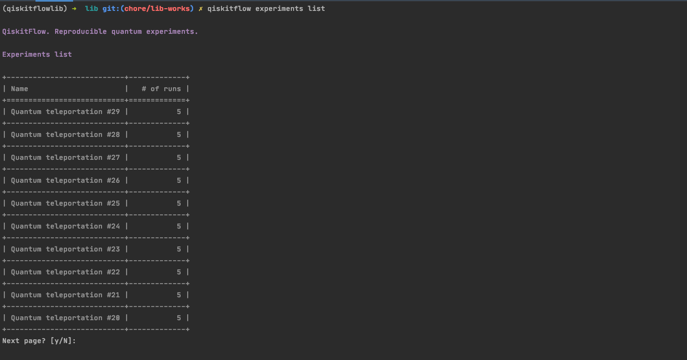
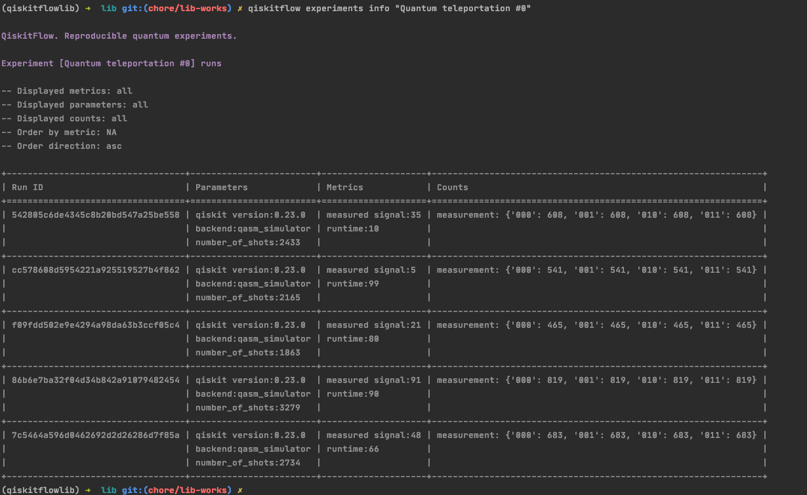
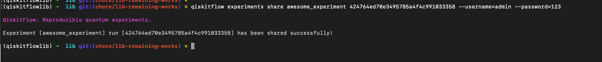

QiskitFlow library
==================

### Hot to run
* [Overview / Flow](#flow)
* [Installation](#installation)
* [Code annotation](#code-annotation)
* [CLI](#cli)
  * [Experiments list](#list-of-experiments)
  * [Experiment information](#experiment-information-runs)
  * [Share experiment](#share-experiment)


### Flow

Flow of actions while using QiskitFlow is following:
- [Install](#installation) QiskitFlow if not installed yet
- [Annotate](#code-annotation) your code with `Experiment` abstraction QiskitFlow library provides
- Run your code as usual: QiskitFlow will write metadata of your experiment execution in local folder 
- You can review and share experiments using [CLI interface](#cli)

> We are tracking metrics, parameters and measurements of experiments. 
> Artifacts, circuits, sourcecode and other useful things are on their way.


### Installation

```shell script
pip install qiskitflow
```


### Code annotation

Library for quantum programs annotation

Example:
```python
from qiskitflow import Experiment

with Experiment("awesome_experiment") as experiment:

    # your quantum program here!
    
    experiment.write_metric("test metric", 0.1)
    experiment.write_metric("test metric 2", 2)

    experiment.write_parameter("test parameter", "test parameter value")
    experiment.write_parameter("test parameter 2", "test paraeter value 2")

    experiment.write_measurement("measurement", {"00": 1024, "11": 0})
```


### CLI


#### List of experiments
```shell
qiskitflow experiments list
```

<details><summary>experiments list screenshot</summary>
<p>



</p>
</details>


#### Experiment information (runs)
```shell
qiskitflow experiments info <NAME_OF_EXPERIMENT> --metrics="<METRIC_NAME>,<OTHER_METRIC_NAME>" --parameters="<PARAM>,<OTHER PARAM>"
```

<details><summary>experiment information screenshots</summary>
<p>

Experiment information


Experiment with specified optional flags


</p>
</details>


#### Share experiment
```shell
qiskitflow experiments share <NAME_OF_EXPERIMENT> <RUN_ID> --username=<YOUR_USERNAME> --password=<YOUR_PASSWORD>
```

<details><summary>experiment sharing screenshot</summary>
<p>



</p>
</details>


